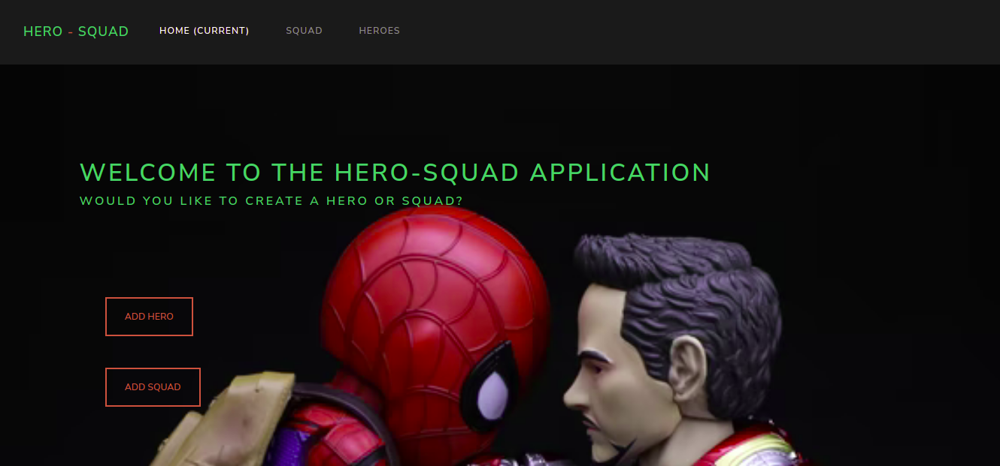

# Quotes Application

## Author

Linet Mutheu

## Demo

### Description

Hero Squad is an application that allows users who interact with it to create heroes and squads that contain a particular number of heroes such as killing squad or intelligence squad. Heroes can be affiliated with only 1 squad at a single time, therefore if the hero was to switch to another group, their name should not be present in the previous squad that they were in.

### Prerequisities

You need to have the following installed on your machine

1. Java JDK
2. Gradle
3. JDK
4. Maven
5. Java IDE (Intellij)

### Setup and Installation

To access this project on your local files, you can clone it using these steps

1. Open your terminal
2. Use this command to clone `$ git clone
   https://github.com/MutheuLinet/Hero_Squad.git
3. This will clone the repository into your local folder
4. Navigate to the folder you cloned into, within src/main/java/App. java and open it with intellij.
5. Go to your browser and type localhost:4567

### Technologies Used

1. HTML
2. CSS
3. Handlebars
4. Java
5. Gradle
6. Spark
7. Junit

### Live Site

[Live Link](https://hero-squad-power.herokuapp.com/)

### License

This project is under the [MIT](LICENSE) licence

### Copyright

Copyright (c) 2022 Linet Mutheu
